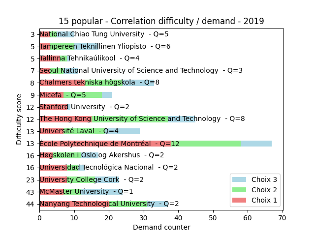
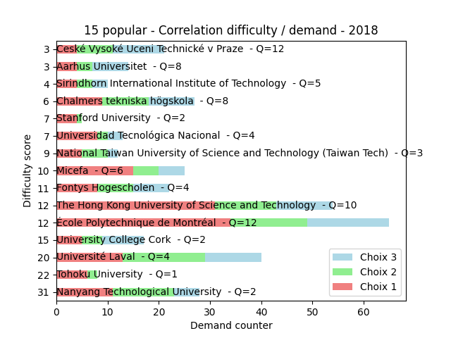
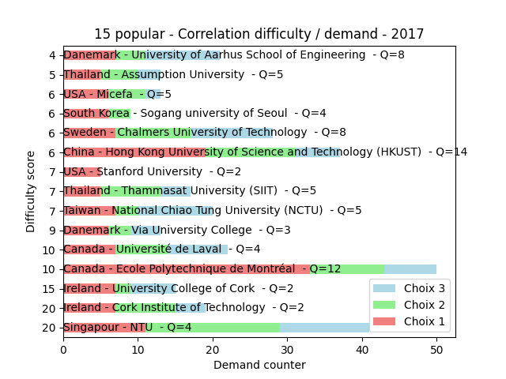
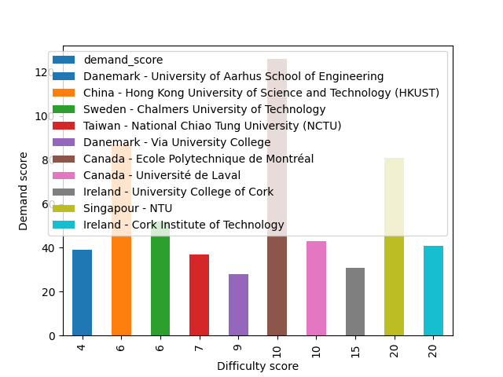
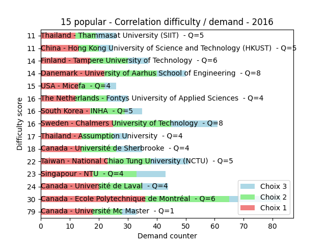
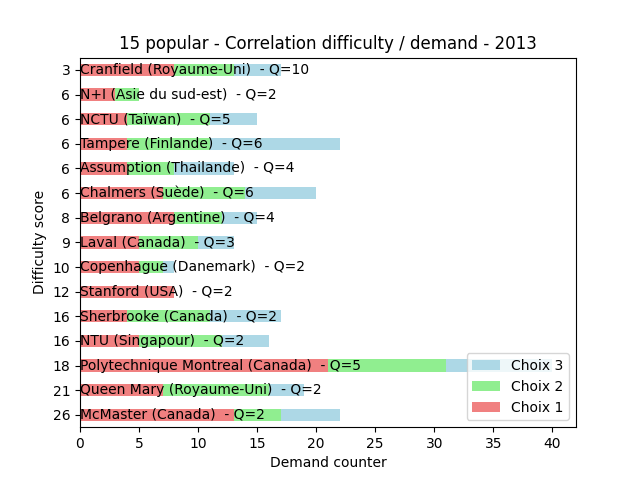

For the 10 most wanted university on first choice I classed them from left to right like this:

```
"demand_score"= 3 x "Choix 1" + 2 x "Choix 2" + 1 x "Choix 3"
"difficulty" = "demand_score" / "Quota"
```


# 2019



# 2018



# 2017



# 2016



# 2015


# 2014


# 2013


